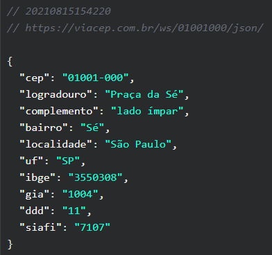

## 📌 ABOUT

📘 **Projeto proposto na Etec Ermelinda,materia de Programação Mobile 2 no curso de Desenvolvimento de Sistemas.**
 
 
O **Aplicativo ViaCep** é  utilizado pra verificar o **seu endereço**. Você que deseja verificar o endereço,é simples e rapido,basta abrir,digitar o seu CEP,clicar em Consultar  e pronto,aparecerá o endereço ai na sua tela !!!

    
    

## 🚀 TECNOLOGIAS 
O app utiliza a seguinte linguagem:
* **REACT NATIVE**

## 🌐 API
A API do **ViaCep** nos permite verificar o endereço desejável apenas com o CEP
* URL: https://viacep.com.br/ws/01001000/json/

    

